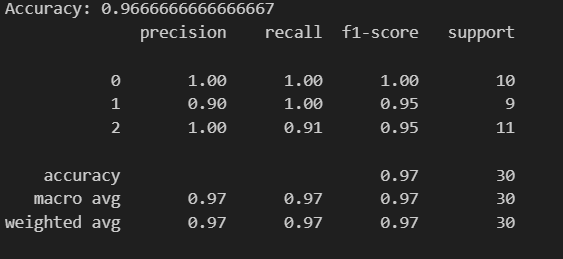
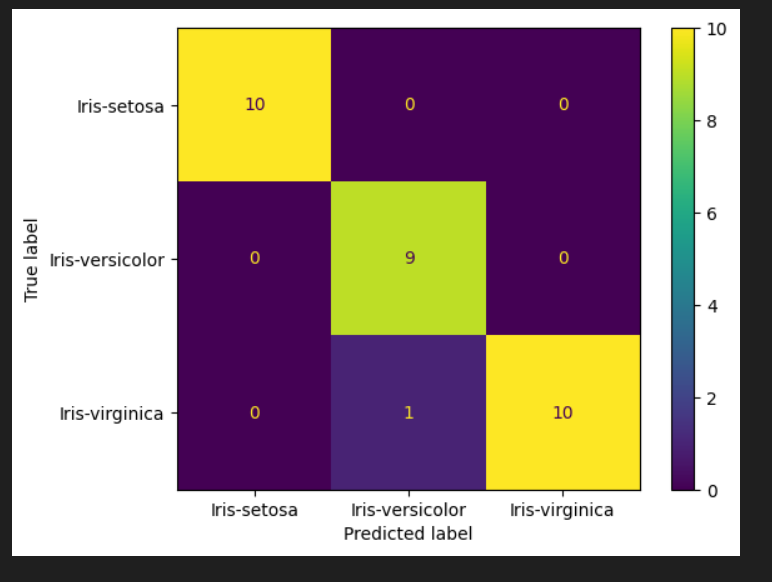

# Iris Flower Species Prediction Model

## Problem Statement
The goal of this model is to **predict the species** of an Iris flower (`Iris-setosa`, `Iris-versicolor`, `Iris-virginica`) based on its **sepal and petal measurements**:

- Sepal Length  
- Sepal Width  
- Petal Length  
- Petal Width  

The dataset contains **150 rows** and **5 columns**, with each species having **50 samples**.  
Some measurements may contain **outliers**, which are natural biological variations. These outliers are included in the training data.

---

## 1. Data Preprocessing
1. **Label Encoding:**  
   The `species` column is categorical, so we convert it to numeric values using `LabelEncoder`:  
   - `Iris-setosa → 0`  
   - `Iris-versicolor → 1`  
   - `Iris-virginica → 2`  

2. **Feature & Target Separation:**  
   - Features (`X`) = `sepals_length, sepals_width, petals_length, petals_width`  
   - Target (`y`) = `species`  

3. **Train-Test Split:**  
   Split the data into **training (80%)** and **testing (20%)** sets.

4. **Feature Scaling:**  
   Use `StandardScaler` to standardize features because SVM is sensitive to feature scale.

---

## 2. Model Selection
We use **Support Vector Machine (SVM)** for classification.

- **Kernel:** `rbf` (Radial Basis Function) → handles non-linear boundaries  
- **C Parameter:** `C=1` → balances margin and misclassification  
- **Gamma:** `'scale'` → scales the influence of individual samples  

**Why SVM?**  
- Works well for small datasets  
- Finds the optimal hyperplane separating classes  
- Can handle non-linear relationships

---

## 3. Model Training
The SVM model is trained on **scaled training data**.  
The model learns to separate the three species based on measurements of sepals and petals.

---

## 4. Model Evaluation
After training, we evaluate the model using the test set:

- **Accuracy:** Percentage of correct predictions is - 96%
- **Classification Report:** Precision, recall, F1-score for each species
- 

- **Confusion Matrix:** Visual representation of correct vs misclassified predictions
- 

Example:  
- `Iris-setosa` is usually predicted correctly  
- `Iris-versicolor` and `Iris-virginica` may have slight overlap

---

## 5. Prediction on New Samples
To predict a new flower:

1. Scale the input using the same `StandardScaler`  
2. Predict the species using the trained SVM model  
3. Decode the numeric label back to species name using `LabelEncoder`

---
